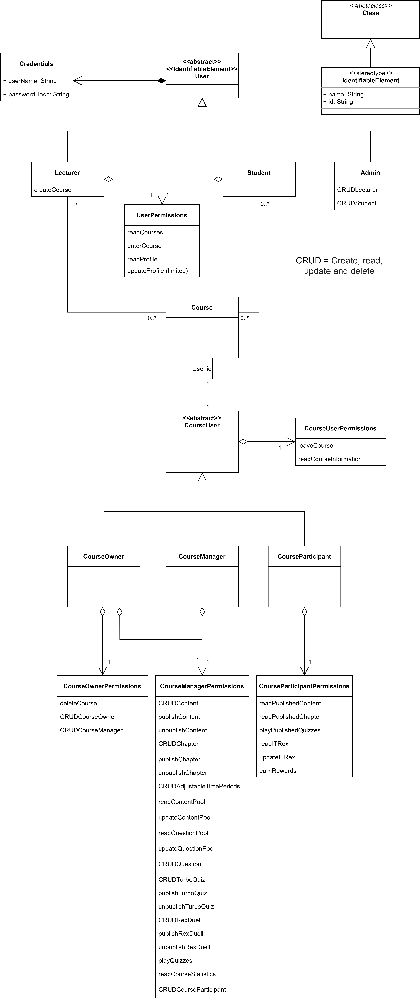

# User Role Model

## Description

Permissions follow CRUD rules where applicable. CRUD = Create, read, update and delete.
"Reading" and "updating" are often used interchangeably with "viewing" and "modifying" in the description. Additionally we used permissions to leave and enter a Course, play Quizzes, publish and unpublish Course elements and earning rewards for gamification.

The model shows two sets of roles, one on the system and the other one on the Course level. System wide roles are set once for every deployment of IT-Rex. Course wide roles are set inside the system for every existing course independently.

System level roles (User):
* Lecturer
* Student
* Admin

Course level roles (CourseUser):
* CourseOwner
* CourseManager
* CourseParticipant

### IdentifiableElement

An IdentifiableElement has a name and an id. The id is used to identify an entity globally. It is used as a Stereotype on other components.

### User

The User represents a system wide user account. It has Credentials and is either a Lecturer, Admin or Student. These roles indicate what the user account is authorized to do in the system.

### Credentials

Users are authenticated by their userName and password (which should be hashed in the system).

### Lecturer

A Lecturer can create Courses in addition to the basic UserPermissions.

### Student

Students have basic UserPermissions.

### UserPermissions

The most basic permissions are viewing existing courses and entering them and viewing and updating the own User profile. The latter is limited because a User should not be able to modify every field (this needs to be specified further). Full update permissions of Users are granted to the Admin.

### Admin

Admin Users can CRUD Lecturers and Students. They are intended to be used by administration personnel of the university or any other person who manages or is responsible for the system. Admin accounts can't be created by other Users but need to be setup manually in the system. The system should provide an Admin account per default.

### Course

A Course is created by a Lecturer. For every User in the Course (represented by the User.id) there is exactly one CourseUser. The Lecturer who creates the Course is automatically set as the CourseOwner. Therefore the Course always has at least one CourseUser. For further information go to [Course Structure Data Model](./Application-Architecture--Data-Model--Course).

### CourseUser

The CourseUser is either a CourseOwner, CourseManager or CourseParticipant. It provides basic CourseUserPermissions to each of these roles.

### CourseUserPermissions

The most basic permissions on Course level are leaving the Cours and viewing general Course information. Leaving the course may be limited for CourseOwners.

### CourseParticipant

CourseParticipants are usually Students who participate in the Course. They can view published Content in Chapters, view and update their personal Course IT-Rex and earn rewards for various actions. Additionally they can play published Quizzes, which includes reading and playing LectureQuizzes, TurboQuiz and RexDuell. A lecturer account cannot participate in course. A student account is needed for that.

### CourseManager

CourseManagers are assistants to the Lecturer who teaches the Course. They can originate from a Student or Lecturer account. They are able to manage most of the Course and its content. This includes CRUD content, chapter, AdjustableTimePeriod, questions, TurboQuiz, RexDuell and CourseParticipants. On top of this they are able to publish and unpublish Content, Chapters, TurboQuiz and RexDuell to be visible/invisible for the CourseParticipants. For testing purposes they are able to play the Quizzes even before they are published. They can also read and update the ContentPool and QuestionPool which are automatically created at Course creation and cannot be deleted independently of the Course. Additionally they can view statistics about the Course (e.g. number and progress of participants).

### CourseOwner

The CourseOwner is the Lecturer who created the Course. They have all the permissions that a CourseManager has. In addition they can delete the Course and CRUD CourseManagers and CourseOwners. In that way it is possible to have several CourseOwners.
