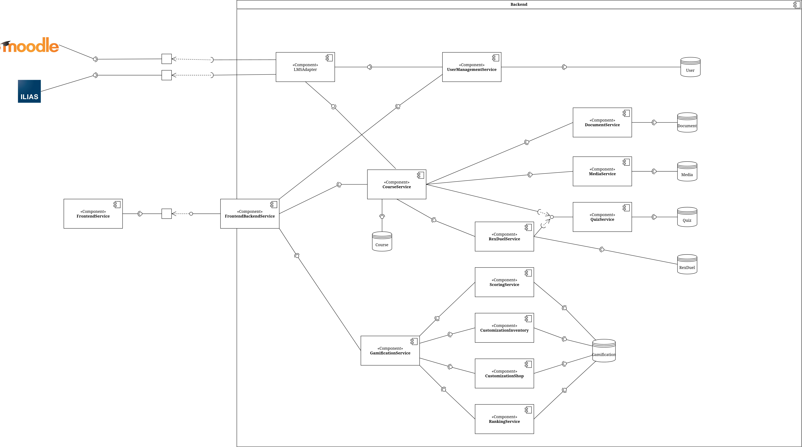
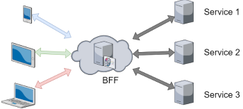

# Implementation View

This page describes general thoughts and design decisions that were used to create the [Component Diagram v2.1](https://miro.com/app/board/o9J_ldsCOKg=/?moveToWidget=3074457352019930466&cot=12).

## **Application Architecture**

In order to enable horizontal scaling for the IT-Rex application, a Microservices Approach was chosen.
The following Diagram shows how the Domain was split up into smaller functional components, the Microservices and their interactions.

For a better understandability, each Microservice will be explained in a section below.
Afterwards, another section covering general information can be found, that is not bound to single Microservices.

## **Client Side**

The Client Side consists of a single Microservice.
As the name suggests, it runs on the client's machine locally.

### **Frontend-Service**
This Service is used for displaying all the relevant information to the user.
It's main tasks are:
 * Manage user Input and forward it to the Backend for Frontend
 * Visualize Data that is received from the Backend for Frontend

With this small set of functionality, the goal was to minimize computational/logical code in order to keep the Frontend-Service as light-weight as possible.
This helps to achieve a smooth User Experience, as well as better performance on the client side.

## **Server Side**

The Server Side consists out of 13 Microservices that together form the Backend of the IT-Rex Application.

### **Frontend-Backend Service**
The [Backend for Frontend](https://samnewman.io/patterns/architectural/bff/) is an architectural pattern, commonly used for multiplatform scenarios.

It enables different implementations for the same backend that provides data to the Frontend-Service for visualisation.
This can be helpful when functionality changes may occur, depending on parameters like the device used by the client.

Additionally, this Service is used to call the other backend Microservices.
Typically this would happen by receiving requests from the Frontend-Service. The Backend for Frontend's tasks then consist out of:
* Validating the received inputs
* Deciding which Microservices are needed to answer the request
* Retrieving the needed Data

To implement this pattern an API language must first be agreed upon. A great alternative to REST is the Query Language [GraphQL](https://medium.com/tech-tajawal/backend-for-frontend-using-graphql-under-microservices-5b63bbfcd7d9) because of less network traffic and higher scalability.

_Comparison of REST and GraphQL:_  
**Data Acquisition:** REST lacks scalability and GraphQL can be accessed on demand. The payload can be extended when the GraphQL API is called.  
**API calls:** REST’s operation for each resource is an endpoint, and GraphQL only needs a single endpoint, but the post body is not the same.  
**Complex data requests:** REST requires multiple calls for nested complex data, GraphQL calls once, reducing network overhead.  
**Error code processing:** REST can accurately return HTTP error code, GraphQL returns 200 uniformly, and wraps error information.  
**Version number:** REST is implemented via v1/v2, and GraphQL is implemented through the Schema extension.  

### **Authentication Service**

In order to use the application, users must be able to log-in.
Through a user's account it is possible for us to identify a users' courses, progress and other necessary information.
Therefore the authentication service is invoked by the Frontend-Backend service.
It's tasks contain:
* Filling the User Database of IT-Rex with current user information
* Fetching Data from the LMSAdapter for the specific User
* Authentication / Providing Access

In order to validate / compare credentials with already existing external systems, the LMS Adapter is invoked, which is another microservice, specifically designed to handle such functionality.

### **LMS Adapter**

The Learning Management System (LMS) Adapter is a microservice designed to connect with external learning platforms.
For our use-case, Ilias and Moodle are two prime examples for such external services.

This service is mainly invoked by the authentication service and the course service.
In order to process user information that is managed in the external learning management systems, an integration is needed and handled inside this microservice.
Fetching the up-to-date user-specific data and providing it is therefore one of the main tasks.
For the course service it is necessary to check for existing information like courses and their meta-data in the LMS systems.
If those are existent, the services is able to fetch them and provide it to the course service.

**!** The LMS adapter has no further functionality than fetching data from the external system to the authentication service / course service. The authentication process of the user is handled entirely within the authentication service. **!**

### **Course Service**

The course service is the main service for processing and providing information that belongs to a course.
It is invoked by the Frontend-Backend service. The course service fetches data about courses (meta information) from the LMS adapter to synchronize and organize courses in IT-Rex.  
Based on incoming requests, the following services are invoked by the course service itself in order to provide the necessary data:
* Document Service
* Media Service
* Quiz Service
* RexDuel Service
* _Scoring Service_

The information provided by the above listed services is then used inside the course service to fulfill tasks like visualizing and publishing certain contents.
Another important task is to transform the invoked data into a single timeline that is split up by chapters.
In order to do so, the course service is connected to a database, where course-specific information is stored persistently.

### **Document Service**

The Document service is invoked by the course service and handles all logic related to displayable documents in the application.
For the beginning, the main focus will be on handling PDF files.
Later-on, other Document formats like .pptx or similar could be supported aswell.

The main functionality inside the service is the management of documents. For this, documents need to be created and stored, modified/replaced and deleted. Therefore the service is connected to the document database. 

### **Media Service**

The Media Service is very similar to the Document service, but focuses on other types of media.
The main focus here lies on video, audio and image formats like .mp4, .mp3 and .svg or .png files.

Just like the Document Service, the Media Service is invoked by the course service.
This is necessary for basic functionality like uplaoding and displaying videos for chapters.
When uploading, chosen files get passed to the document service, which manages the storage in its own Media Database.
Additionally, it reads from the Media Database in order to provide the requested Media to each user.
Modifying, updating and adding content are other tasks that are handled inside here.

### **Quiz Service**

The Quiz service is used by the Course service in order to get, create, modify or delete quizzes.
By providing questions and answers, along with quiz settings and meta information, quizzes can be created inside the quiz service and stored in the connected Quiz Database.

The main functionality resides in delivering a quiz object to the course service with correct questions and answers for the given context (i.e. Questions for the correct chapter in the correct course).

Depending on the context, three different modes for the returned quizzes seem to be useful:
* Lecture Quiz: This is the normal quiz that would be used in the context of a chapter inside a Course.
* Turbo Quiz: A timed Quiz that contains all questions inside a course for an exam-like feeling.
* Rex-Duel Quiz: Specified rex-duel approved questions, that are course-wide.

### **Rex Duel Service**

### **Gamification Service**
### **Scoring Service**
### **Customization Inventory**
### **Customization Shop**
### **Ranking Service**

## **External Services**

## **General Design & Decisions**

This kind of functionality is distributed and spread across services, that own the Data
