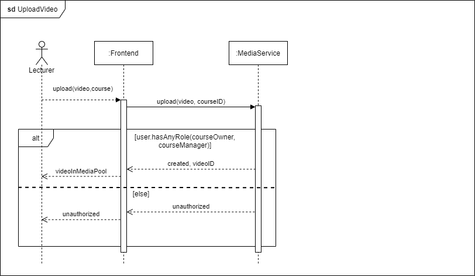
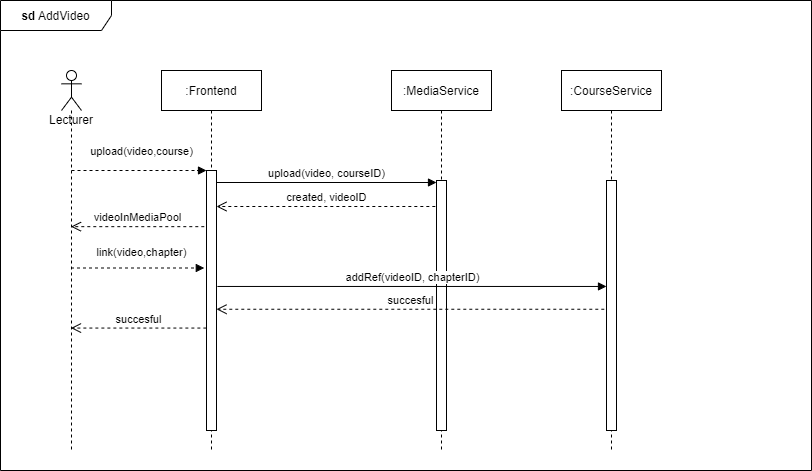
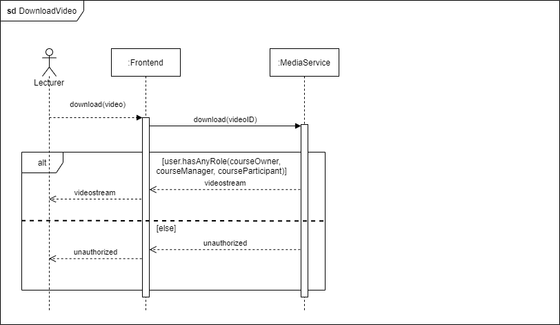

This page describes general thoughts and design decisions that impact the architecture implementation regarding the communication flow in the application to implement the desired scenarios (dynamic viewpoint). 

# General Communication Approach

The decision was to use HTTP for any interaction in our system, both from the client app to the gateway service as well as between the gateway and the microservices. 

The reasoning was to have a consistent, lightweight communcation that can easily be routed from the gateway to the individual microservices without the need to translate or transform the requests in any way, and that all client platforms can make use of.

# Restrictions in Runtime Behaviour

In order to implement behaviour in a way that fits well to our application architecture, we list the most important restrictions we decided to follow as well as the reasoning behind.

Some of the design decisions that restrict runtime behaviour are [already described in the implementation view](./Application-Architecture--Implementation-View#design-decisions) as they are related and resulting from the static application structure. Here, we summarize the important decisions focusing only on the dymanic aspects.

If user actions logically involve requests to mulitple microservices, this should be handled as follows:
* **Service-to-service communication should be avoided** at all cost. Reason: We use synchronous, non-transactional HTTP. If service A performs part 1 of the action, invokes part 2 of the action to be executed by service B, but service B fails, this is difficult to handle. If service-to-service communcation is implemented, we must ensure that partial failing of the request does not lead to inconsistent states, and the application can handle the state that it is left with. At the current state, we do not have an architectural concept to cope with shared data.
* Preferrably, a user action in the client application leads to max. one backend call. However, **logically connected backend calls may be wrapped in a sequential UI flow with known operational states**  without reveiling that mulitple backend calls to multiple services are required. E.g., if the a lecturer pressed the "Delete Video" button of a video element in the course structure, they will first see a list of all chapters that reference (use) this video item. After confirming to delete the video from all these chapters, the video will also be deleted from the media pool. The user does not know, that first a request to delete all references in the course service was sent, and then another request to the media service to delete the video. Even if the second call fails, the first call (delete references) leads to a known operational state the client app can handle: The video is not referenced in the course chapters anymore, but still available in the courses media pool. This is the same state as if a lecturer had only uploaded it to the media pool and had not linked it to a course chapter yet.

Whenever special request patterns or exceptions to the restrictions above are implemented, they must be documented in [Exceptional Runtime Behaviour](#Exceptional-Runtime-Behaviour).

# Runtime Scenarios
## Scenario: UploadVideo

## Scenario: AddVideo

## Scenario: DownloadVideo

# Exceptional Runtime Behaviour

|:warning: Whenever special request patterns or exceptions to the [restrictions above](#Restrictions-in-Runtime-Behaviour) are implemented, they must be documented here. |
|---|
## Scenario: CreateCourse

