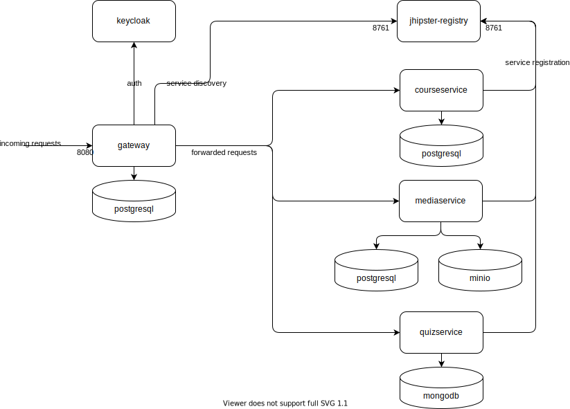

# Deployment Overview Diagram

The following components are currently deployed in a docker environment on our [vServer](./vServer).



(Source-File: [Sharepoint](https://rssiste.sharepoint.com/:u:/r/sites/IT-REX-Developers/Freigegebene%20Dokumente/Architecture/cd_environment?csf=1&web=1&e=c3GLOg))

# Description

This page aims to provide the reader with a quick overview of our deployment procedure.

We're hosting an always-up-to-date version of our application (based on the latest main branch commit) on our development vServer.
The Registry, Gateway, microservices, KeyCloak, MinIO and other components each run as docker containers in a shared network.  
All relevant docker-compose files can be found in our *Backend-Deploy* repository inside the ```docker-compose/``` directory.

For our deployment cycle, we employ a small collection of helper tools. These can be found inside the ```tools/``` directory in *Backend-Deploy*.  
In general, the flow works as follows:

*continuouslydeploy.sh* is monitoring ```/srv/Backend/cd/``` (which is mounted as a volume in our Jenkins docker container) for creation of new "deploy" files inside all subdirectories named after services.  
As part of our Jenkins pipeline, specifically in the *deploy* stage, new versions of docker images of our services are being copied into this shared volume from inside the Jenkins docker container. After this is finished, Jenkins also creates an empty "deploy" file alongside the fresh image to signal to *continuouslydeploy.sh* that a service is ready for redeployment.  
When this routine is triggered, *continuouslydeploy.sh* passes an image name to *updatecontainer.sh*, which will then stop the running container for the service in question, delete the old image, load the new image from file and restart the service.

Lastly, *continuouslydeploy.sh* is being executed as an auto-launched systemd service on the server. The service definition is located at ```/etc/systemd/system/itrex-backend-cd.service```. It points to /home/ubuntu/Backend-Deploy/tools/continuouslydeploy.sh, so in order to update the deployment flow, a ```git pull``` inside ```~/Backend-Deploy``` followed by a ```sudo systemctl restart itrex-backend-cd``` should suffice.

### Side note

In order to re-launch the entire application stack after a server reboot, execute ```launchbackend.sh``` in ```/home/ubuntu/Backend-Deploy/tools/```.
