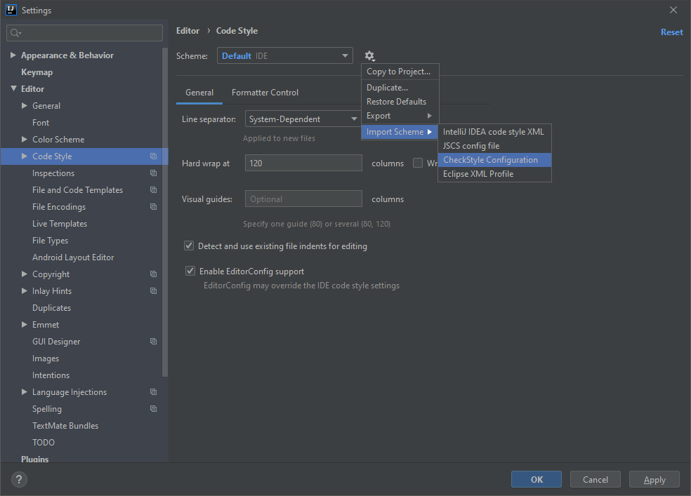

# Static Code Analysis
"Static code analysis is a method of debugging by examining source code before a program is run. 
It’s done by analyzing a set of code against a set (or multiple sets) of coding rules."[1](https://www.perforce.com/blog/sca/what-static-analysis)

## Quality Metrics and Heuristics
Some metrics for good code that should be covered by a static analysis tool.  Can be changed / completed by the team.
- **Maintability:** (see Microsoft's Maintainability Index). Often done on method-level
- **Cyclomatic complexity:** indicates complexity of a program by quantitatively measureing the number of linearly independent paths through a program's source code. A complex control flow requires more tests to achieve good code coverage and will be less maintainable. Can be done module or program-wise Includes:
    - Depth of Nested IF/ELSE statements
    - multiple SWITCH/CASE statements
- **Lines of code:** measured on diffrent levels: project / class / method. A very high count might indicate that a type or method is trying to do too much work and should be split up. It might also indicate that the type or method might be hard to maintain.
- **Coupling:** Measure in two directions - How many components are using the measured component and on how many components it relies on. A high number indicates that any change to the current component risks breaking those others, if many components depend on the measured one and vice versa.
- **Churn:** amount of edits (number of commits) to a source code file. A high churn indicates specific areas of the system that undergo a lot of updates. Exept for exceptions, this is normally an indicator that there are quality problems within a file.
- **Clones**
- **Compliance with Coding Conventions**

## Frontend: Expo/TypeScript 

## Backend: Java/Spring Boot 

### Code Conventions
To check if the written source code in the backend conforms to the [Google Java Style Guide](https://checkstyle.sourceforge.io/styleguides/google-java-style-20180523/javaguide.html) 
the development environment Intellij and the Plugin Checkstyle are used. 

"Checkstyle is a development tool to help programmers write Java code that adheres to a coding standard. It automates the 
process of checking Java code to spare humans of this boring (but important) task. This makes it ideal for projects that 
want to enforce a coding standard." [2](https://checkstyle.sourceforge.io/index.html)

Intellij is a leading Java IDE with built-in code inspection and analysis. With the additional help of the Checkstyle Plugin,
Intellij takes care of the correct formatting, e.g. with regard to indentation (In relation to the Google Java Code Guidelines), 
and marks violations of the Google Java Code Guidelines. A list of what conventions Checkstyle checks can be found [here](https://checkstyle.sourceforge.io/google_style.html). 

#### Plugin installation and configuration Checkstyle

**Precondition:** Intellij is already installed and opened 
 
1. Navigate to: File &rarr; Settings &rarr; Plugins
2. Search for **CheckStyle-IDEA** and install the plugin
3. Navigate to: File &rarr; Settings &rarr; Tools &rarr; Checkstyle 
4. Select **Google Checks** as Configuration File
5. Adjust the scan scope if necessary 

Adding the code style schema to the editor:
5. Download the google_style.xml 
6. Navigate to:  File &rarr; Settings &rarr; Editor &rarr; Code Style
7. Import the google_style.xml scheme as follows: 

 **&rarr; Restart Intellij**
 
 After the restart the CheckStyle Plugin automatically checks the Google Java Style Conventions in the Background and marks the violations in the editor.  

 
### Bug hunting 
- Find Bugs 
- Spot Bugs 

  

## Sources
- [1] [Static Code Analysis](https://www.perforce.com/blog/sca/what-static-analysis)
- [2] [Checkstyle](https://checkstyle.sourceforge.io/index.html)
- [List of Tools for static code analysis](https://en.wikipedia.org/wiki/List_of_tools_for_static_code_analysis)
