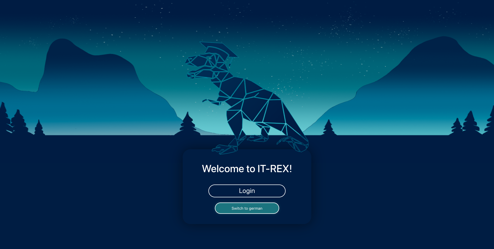
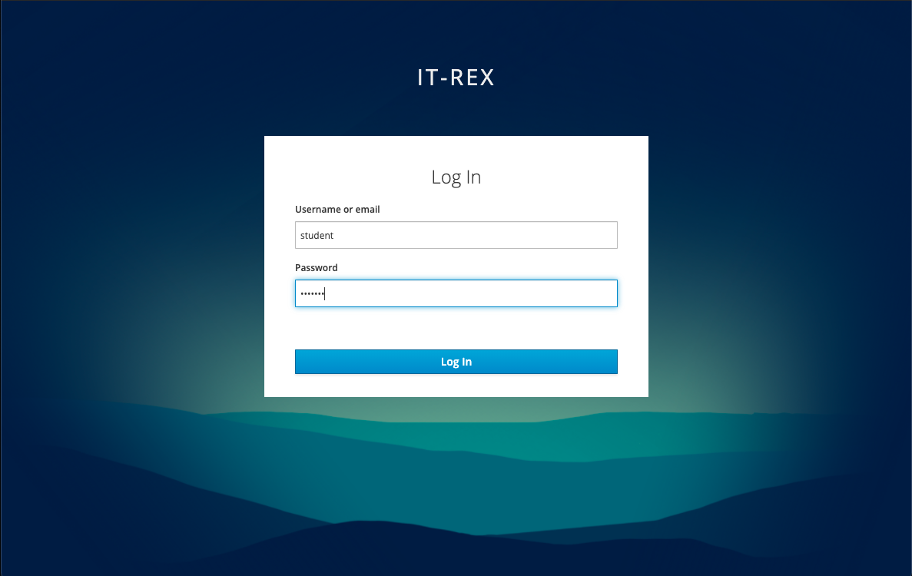
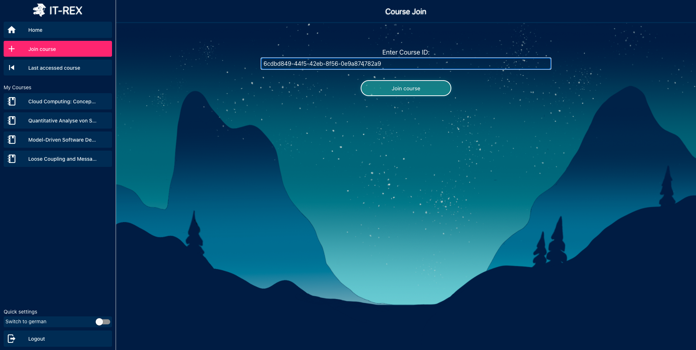
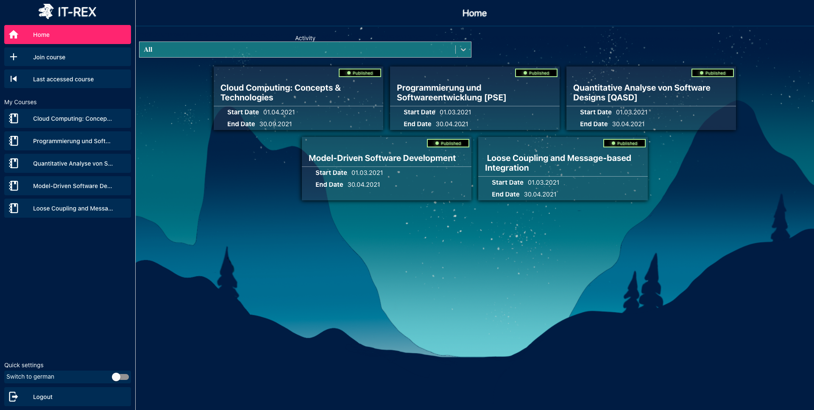
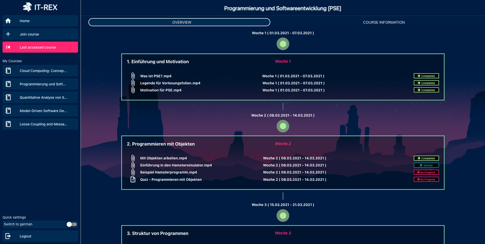
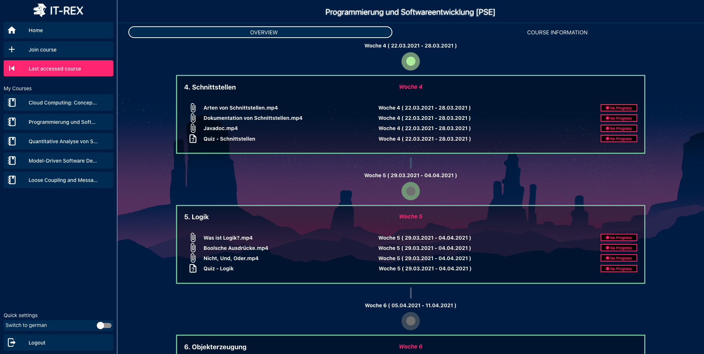
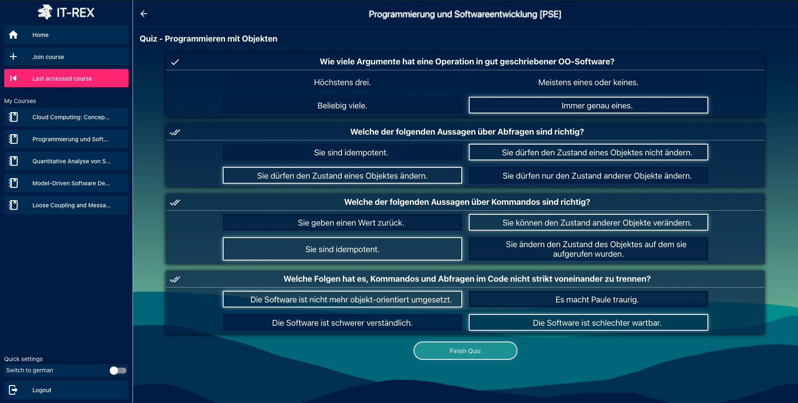
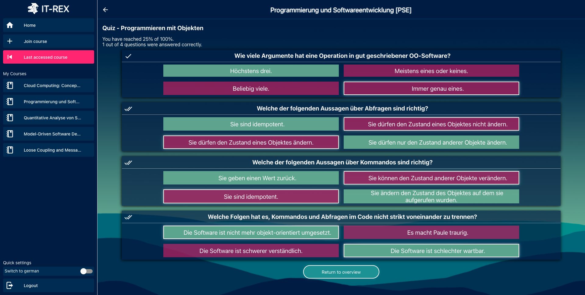

This page is a short user guide that is applicable to you, esteemed reader, if you want to use IT-REX as a student. Hop right in!

- [How to use IT-REX as a student?](#how-to-use-it-rex-as-a-student)
  - [Login](#login)
  - [Join a Course](#join-a-course)
  - [Track study progress](#track-study-progress)
  - [Study a course](#study-a-course)
    - [Watch Videos](#watch-videos)
    - [Solve Quizzes](#solve-quizzes)

## Login

Starting on the Landing Page, the student is able to login into the IT-REX application.

Therefore he uses his own credentials, e.g. in this example the credentials:  
**Username: student**  
**Password: student**

## Join a Course

The student can directly join a published course by clicking on _"Join course"_ in the navigation bar on the left side.

There is no other possibility than to get the course ID from the lecturer and insert it manually into the input field on the join a course screen.  

After joining a course (in this case it was _"Programmierung und Softwareentwicklung [PSE]"_) the newly joined course is added to the student's home screen. All of the student's courses are displayed here.

## Track study progress

When clicking on a specific course (e.g. on _"Programmierung und Softwareentwicklung [PSE]"_) the student is redirected to the course overview.

The student is directed to the course timeline, which is necessary to track and compare personal and expected learning progress. This page also provides the student information about the chapters in the course and learning material, i.e. lecture videos and quizzes. This material is marked with labels indicating in which week the student should watch a video or solve a quiz.  

In order to compare the personal learning progress with the expected one, the student gets the finished, started and open learning tasks (on the right side of a chapter) displayed. This is the current learning progress. For the expected learning progress, the grey/green circles between the chapters show the status of the chapter:

- A _**grey outer**_ and _**grey inner**_ circle indicates that the chapter should be done in future.  
- The _**green outer**_ and _**grey inner**_ circle means that the student should work on the chapter in this week (i.e. right now). So the chapter has to be finished with the end of the week.  
- The _**green outer**_ and _**green inner**_ circle indicates a chapter which should already be done in the past. So the student should be finished and worked on that chapter. 

## Study a course

The IT-REX application is designed to help students study. Therefore, IT-REX offers the possibility to watch lecture videos and solve quizzes.

### Watch Videos

To view a lecture video, the student must click on a chapter.  
The first video is displayed directly and a queue of subsequent videos on the right. The current progress of the video watch time is also displayed on the right.

A video is marked as done (light green) when it is viewed completely.

### Solve Quizzes

Solving a quiz is also possible in the content view of a chapter (like watching videos). Quizzes can be accessed by clicking on a quiz on the right side.

The student has to answer single-choice, multiple-choice, and numerical questions and finish the quiz after answering all questions.  
(**_Note: The answers displayed are for demo purposes only and are not correct._**)  

After solving the quiz, the student receives feedback directly.  
IT-REX provides the quiz results in this way:

(_Also here the answers in the picture are just for demo purposes_)
